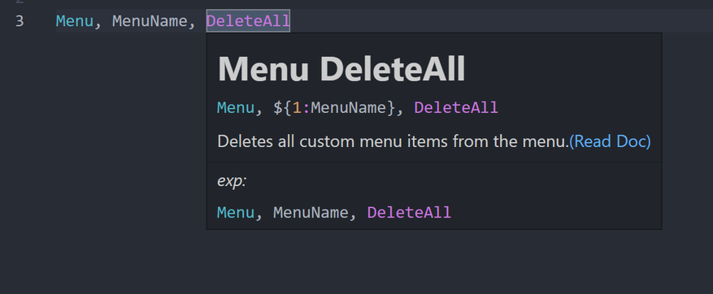

# Changelog

- [Changelog](#changelog)
  - [NEXT 0.0.26(2023-03-XX)](#next-00262023-03-xx)
  - [0.0.25(2023-02-26)](#00252023-02-26)
  - [0.0.24(2023-02-24)](#00242023-02-24)
  - [\<= 0.0.23(2023-02-17)](#-00232023-02-17)

## NEXT 0.0.26(2023-03-XX)

- add: hover at `Menu` / `Gui` / `GuiControl` SubCommand , exp: `Menu DeleteAll`
  
- add: more Completion of `Sub-commands` && provide config control `"AhkNekoHelp.snippets.expandSubCommand"` [(Preview it)](https://github.com/CoffeeChaton/vscode-autohotkey-NekoHelp/blob/main/note/config/snippets.expandSubCommand.md)
- fix: some uri from old-packages to new-packages
- fix: limit completion of `Menu` / `Gui` / `GuiControl` sub-command

## 0.0.25(2023-02-26)

- fix: `HotString` has [X-flag](https://www.autohotkey.com/docs/v1/Hotstrings.htm#Options) case\
  if `HotString` has X-flag, then it look like

  ```ahk
  ::case0,,::foo() ; "send foo()"


  :X:case1,,::foo()  ; call foo() function

  ::case2,,::  ; call foo() function
    foo()
  Return
  ```

  other exp

  ```ahk
  name_copied := "XX"
  :X:name,,::Send, % "The name is " name_copied
  ;                                 ^^^^^^^^^^^var
  ;          ^^^^Send key https://www.autohotkey.com/docs/v1/lib/Send.htm
  ;^ X-flag https://www.autohotkey.com/docs/v1/Hotstrings.htm#Options

  ;....
  name_copied := "XX"
  :XB0:name,,::Send % "The name is " name_copied
  :X B0:name,,::Send % "The name is " name_copied
  ; ^ has space does not affect.
  :B0X:name,,::Send % "The name is " name_copied
  ```

- feat: add more format config in file

  ```ahk
  ;@ahk-neko-format-ignore-start
  ;@ahk-neko-format-ignore-end 
  ;@ahk-neko-format-inline-spacing-ignore-start ;pairing `AhkNekoHelp.format.textReplace`
  ;@ahk-neko-format-inline-spacing-ignore-end
  ```

- feat: add Comment Completion

  ```ahk
  ;@ahk-neko-ignore 1 line
  ;@ahk-neko-ignore-fn 1 line

  ;@ahk-neko-format-ignore-start
  ;@ahk-neko-format-ignore-end
  ;@ahk-neko-format-inline-spacing-ignore-start
  ;@ahk-neko-format-inline-spacing-ignore-end
  ```

## 0.0.24(2023-02-24)

- fix: `1.e3` syntax-highlight

- perf: format 3X~10X
  - if all files not changed

  | ms       | 0.0.23    | 0.0.24  | x   |
  | -------- | --------- | ------- | --- |
  | 88-files | 1600~1800 | 450~600 | 3X  |
  | 29-files | 700~800   | 50~80   | 10X |

  - if all files changed

  | ms       | 0.0.23    | 0.0.24    | x  |
  | -------- | --------- | --------- | -- |
  | 88-files | 1600~1800 | 1600~1800 | 1X |
  | 29-files | 700~800   | 700~800   | 1X |

  > use command `format All File`

## <= 0.0.23(2023-02-17)

> <https://github.com/CoffeeChaton/vscode-autohotkey-NekoHelp-Old/blob/master/CHANGELOG.md>
