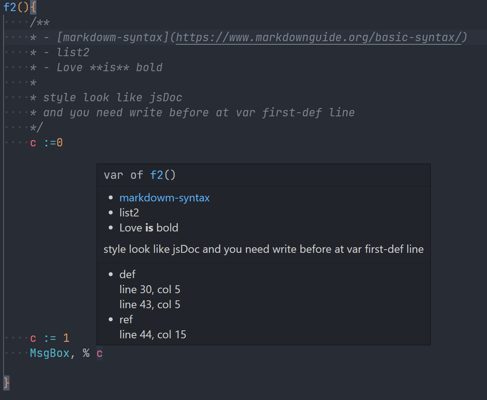
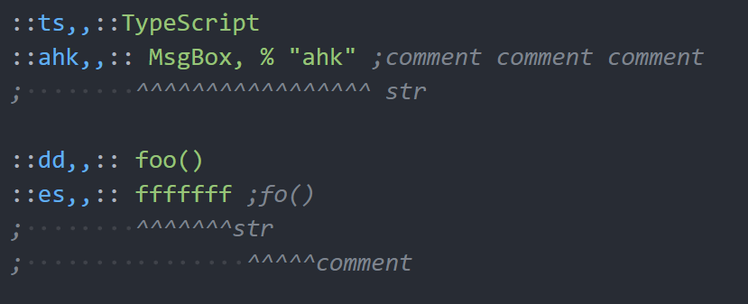

# Changelog

## Next 0.0.24(2023-02-XX)

- fix: `1.e3` syntax-highlight

- perf: format 3X~10X
  - if all files not changed

  | ms       | 0.0.23    | 0.0.24  | x   |
  | -------- | --------- | ------- | --- |
  | 88-files | 1600~1800 | 450~600 | 3X  |
  | 29-files | 700~800   | 50~80   | 10X |

  - if all files changed

  | ms       | 0.0.23    | 0.0.24    | x  |
  | -------- | --------- | --------- | -- |
  | 88-files | 1600~1800 | 1600~1800 | 1X |
  | 29-files | 700~800   | 700~800   | 1X |

  > use command `format All File`

## 0.0.23(2023-02-17)

- feat: find func reference at `Sort, MyVar, F IntegerSort` [[Read doc]](https://www.autohotkey.com/docs/v1/lib/Sort.htm)

  ```ahk
  MyVar := "5,3,7,9,1,13,999,-4"
  Sort, MyVar, F IntegerSort D,
  ;              ^^^^^^^^^^^ func after F[ \t]
  MsgBox, % "MyVar is " MyVar

  IntegerSort(a1, a2)
  {
    return a1 - a2
  }
  ```

- feat: find func reference at `RegEx CallOut Functions` [[Read doc]](https://www.autohotkey.com/docs/v1/misc/RegExCallout.htm#callout-functions)

  ```ahk
  Haystack := "The quick brown fox jumps over the lazy dog."
  RegExMatch(Haystack, "i)(The) (\w+)\b(?CCallout)")
  ;                                       ^^^^^^^ func
  Callout(m) {
    MsgBox m=%m%`nm1=%m1%`nm2=%m2%
    return 1
  }
  ```

- feat: Provider a diag [note/code601.md](https://github.com/CoffeeChaton/vscode-autohotkey-NekoHelp/blob/master/note/code601.md) avoid def-func-name affect [`Hotkey, KeyName , Label`](https://www.autohotkey.com/docs/v1/lib/Hotkey.htm)
- feat: add hover of `label:`
- feat: better log of `FormatAllFile` and `Refresh Resource`
- feat: use CodeLens at file top show more tools
  1. report this file def-func usage in each file
  2. analyze this file ref-func Source
  3. report this def/ref global variables
- feat: check of Rename newName
  1. check newFnName has been defined as `function` `class` `label`
  2. default not rename `"fnName"` , can use `AhkNekoHelp.Rename.functionInStr` open it [[Read more]](https://github.com/CoffeeChaton/vscode-autohotkey-NekoHelp/blob/master/note/code601.md)
- feat: via `'0 -> Refresh Resource from workspace'` to find each file parsing time.
- fix: move `Reload` `Pause` from cmd -> `Flow of Control`, also fix syntax-highlight
- fix: case of multi_line vs hotkey , exp : `(:: foo()` is hotkey not multi_line
- fix: completion of `Gui, add` `Gui, new` ...etc
- fix: syntax-highlight of `else()` `GoSub()` ...etc to look like `func()` , because it's legal and works.
  > and i Provider a diag a diag [code304](https://github.com/CoffeeChaton/vscode-autohotkey-NekoHelp/blob/master/note/code304.md) check define a function name look like [Flow of Control](https://www.autohotkey.com/docs/v1/Language.htm#control-flow).

- fix: format `HotStr` trigger range has `([{`
- fix: format do not indent `HotKey` `HotStr` `Label` line, even if it is through
- fix: format multi_line tail out of control
- fix: [#21](https://github.com/CoffeeChaton/vscode-autohotkey-NekoHelp/issues/21)
  1. feat: add hover of `Gui, Sub-commands`
  2. feat: add support variable `Gui, add` `vVarName`

  ```ahk
  Gui, MInfo:Margin, 7, 7
  ;----^^^^^                hover here show `hover at GuiName`
  ;----------^^^^^^         hover here show `Sets the margin/spacing used whenever no explicit position has been specified for a control.`
  Gui, MInfo: Margin, 7, 7
  ;----------^ allow \s
  ```

## 0.0.22(2023-02-07)

- feat: add hove of `Gui` g-label part1 [#21](https://github.com/CoffeeChaton/vscode-autohotkey-NekoHelp/issues/21)
- feat: add new CodeLens at file top, wait todo more tools fo it.
- feat: lint Hover WinMsg
- fix: format bug [#22](https://github.com/CoffeeChaton/vscode-autohotkey-NekoHelp/issues/22)
- fix: highlight of `#include` has comment case

## 0.0.21(2023-02-05)

- feat: add jsdoc-style comments of variable 

```ahk
f2(){
    /**
    * - [markdowm-syntax](https://www.markdownguide.org/basic-syntax/)
    * - list2
    * - Love **is** bold
    *
    * style look like jsDoc
    * and you need write before at var first-def line
    */
    style1 := 0

    MsgBox, % style1 ; try to hover of "style1"!

    style2 := 1 ; i look like c++ doc style
    MsgBox, % style2 ; try to hover of "style2"!
}
```

- feat: add format `ahk-obj not close` case
- feat: add format config

  ```jsonc
  // settings.json
  {
      "AhkNekoHelp.format.useTopLabelIndent": true,
      "AhkNekoHelp.format.useParenthesesIndent": true,
      "AhkNekoHelp.format.useSquareBracketsIndent": true
  }
  ```

- feat: diagnosis `#Directives` Symbol provide clear information
- fix: ahk-hot-string syntax-highlight
  
- fix: analyze `~F10:: hotKey` `::hk,,:: HotString` Symbol
- fix: `big-change` fix `getLStr()`
- fix: class def-line comment syntax-highlight
- fix: `#if` syntax-highlight and hover
- [v1.1.20+](https://www.autohotkey.com/docs/v1/misc/Labels.htm#Functions): Functions can be used in place of labels in a number of cases, including:
  >
  >- not plan to support [~~[Gui events](https://www.autohotkey.com/docs/v1/lib/Gui.htm#Labels) such as GuiClose~~]
  >- OK [Gui control events](https://www.autohotkey.com/docs/v1/lib/Gui.htm#label) (g-labels)
  >- OK [Menu](https://www.autohotkey.com/docs/v1/lib/Menu.htm#Functor)
  >- OK [Hotkey](https://www.autohotkey.com/docs/v1/lib/Hotkey.htm#Functor)
  >- OK [SetTimer](https://www.autohotkey.com/docs/v1/lib/SetTimer.htm#Functor)

## 0.0.20(2023-01-28)

- add: `ctrl + T` , go to Symbol append prefix
  >
  > - class -> `class className`
  > - function -> `fn functionName()`
  > - label -> `label labelName:`
  > - HotKeys -> `HK HotKeysName`
  > - HotString -> `HS HotStringName`

- add: `100%` doc of [A_Variables](src/tools/Built-in/A_Variables.data.ts)
- add: diag don't allow `label-name` or `var-name` name like func.
  >
  > - `c511` diag [var/param "varName" is the same func-name "funcName()"](src/provider/Diagnostic/tools/CDiagFnLib/C511Class.ts)
  > - `c512` diag [global-val "varName" is the same func-name "funcName()"](src/provider/Diagnostic/tools/CDiagFnLib/C512Class.ts)
  > - `c513` diag [label "labelName" is the same func-name "funcName()"](src/provider/Diagnostic/tools/CDiagFnLib/C513Class.ts)

- fix: move built-in uri to ahk doc v1 && add unit.test
- fix: Def `startWith("}")`
  <details><summary>example code</summary>

  ```ahk
  fnDef1(){
      ;
  } fnDef2(){ ; also a fn def
      ;
  }

  class ClassExp {
      method1(){

      } method2(){  ; also a  method def

      }
  }

    Switch A {
      case 1: i :=0
  }  Switch B   { ;<------------------- also Switch
      case 2: j :=0
  }

    class  ca  {

  }    class cb { ; <------------------- also class

  }
  ```

  </details>

## 0.0.19(2023-01-23)

> add: ahk v2 [announcement](https://www.autohotkey.com/boards/viewtopic.php?f=24&t=112989) with [README.md](README.md), happy to ahk v2 </br>
> this pack while support until ahk v1 while not fix bug.

- add: more Completion of [`gui`](src/tools/Built-in/Gui/gui.data.ts) exp: `GuiAdd` `GuiShow`
- add: syntax-highlight && Completion && hover of [ahk_class ahk_id etc...](https://www.autohotkey.com/docs/v1/misc/WinTitle.htm)
- add: cmd `list this file-def-functions ref` [#11](https://github.com/CoffeeChaton/vscode-autohotkey-NekoHelp/issues/11)
- add: CodeLens with func ref of all pack [CodeLensFuncRef](image/CodeLensFuncRef.png)
- add: `log.info('Extension active!')` [#8](https://github.com/CoffeeChaton/vscode-autohotkey-NekoHelp/issues/8)
- feat: move report to new-file, not use OUTPUT
- fix: Structured of config [configStructured](image/CHANGELOG/v0-0-19.png)
- fix: syntax-highlight of `Loop, Files|Parse|Read|Reg`
- fix: syntax-highlight of `gui`
- fix: syntax-highlight of `byRef`
- dev: (console.log() && OutputChannel) -> LogOutputChannel
- customize: Hover function name ballon clickable [#10](https://github.com/CoffeeChaton/vscode-autohotkey-NekoHelp/issues/10)
- perf: find all references of function

> - old : 26ms 28ms 24ms 27ms ... usually at 15~30ms with my test pack
> - now : 52ms 1ms 3ms 2ms ... use map to remember

- fix: ref error

  ```ahk
  MsgBox,
  ( LTrim c
    fnName() ; <- this is not fn-ref
  )
  ```

## 0.0.18(2022-12-21)

- _break-change_: ahk-doc position move to before fn_def 1 line.

  ```ahk
  /**
  * @new ahk-doc new position
  */
  func_new(){
    ;...
  }

  func_old(){
    /**
    * @old ahk-doc old position
    */
  }
  ```

- add: `;@Ahk2Exe-` hover / Completion [Ahk2exe.data](src/tools/Built-in/Ahk2exe.data.ts)
- add: semantic-highlight of `Goto label` and `GoSub label`
- dev: add test lock [Built-in Data](src/tools/Built-in) and [ahk.tmLanguage.json](syntaxes/ahk.tmLanguage.json)
- dev: add unit.text to `Test Suites: 12` `Tests: 26`
- dev: more structured [ahk.tmLanguage.json](syntaxes/ahk.tmLanguage.json) reference js/c++ tmLanguage
- fix: find variables of the `k` of `for k in array`
- fix: find variables of the `err` of `catch err`, and +Completion of `err.Message` ex:

  ```ahk
  Key1 := "F11"
  Try, Hotkey, %Key1%, label1

  Catch err {
    ; try to use `.` to err
    MsgBox, % "Extra : " err.Extra ;Extra : label1
    MsgBox, % "File : " err.File ; C:\XXXX\exp.ahk
    MsgBox, % "Line : " err.Line ; 10
    MsgBox, % "Message : " err.Message ;Target label does not exist.
    MsgBox, % "What : " err.What ;Hotkey
  }
  ```

- fix: match [command](src/tools/Built-in/Command.data.ts) after `try`

  ```ahk
  Key1 := "F11"
  Try Hotkey, %Key1%, label1
  ;     ^ match command after `try`
  Catch, e {
      MsgBox, % e.Message ;Target label does not exist.
  }
  ; label1:
  ; MsgBox, % "CC"
  ; Return
  ```

- fix: match variables of comment to next line

  ```ahk
  global v1 := 1
    , v2 :=2
    ; comment line but v3 also is global variable
    , v3 :=3
  ```

## 0.0.17(2022-12-3)

- add: syntax-highlight of `;@Ahk2Exe-%U_V%`
- fix: support `DefProvider` `HoverProvider` `ReferenceProvider` with temp-file.
- fix: syntax-highlight of `/*`
- feat: support [AutoHotkey_L v1.1.36.00](https://github.com/Lexikos/AutoHotkey_L/releases/tag/v1.1.36.00)

1. support `VerCompare()` syntax-highlight && Completion && hover
2. support ignore ahk2 file if use

```ahk
#Requires AutoHotkey v2.0-a
#Requires AutoHotkey >=2.0- <2.1
#Requires AutoHotkey >2.0- <=2.1
#Requires AutoHotkey v2.0-rc.2 64-bit
```

## 0.0.16(2022-11-30)

- add: ignore ahk2 file if use `#Requires AutoHotkey v2`
- add: syntax-highlight of `;@Ahk2Exe-`
- feat: move `ahk.snippets.json` to ts
- fix: limit Statement completion range
- fix: code107 diag range

## 0.0.15(2022-11-20)

- add: Diagnostic Master Switch config
- add: mare config of Diagnostic

```jsonc
// settings.json // https://stackoverflow.com/questions/65908987/how-can-i-open-visual-studio-codes-settings-json-file
{
    "AhkNekoHelp.Diag.AMasterSwitch": "auto",
    "AhkNekoHelp.Diag.code107LegacyAssignment": true,
    "AhkNekoHelp.Diag.code300FuncSize": 100,
    "AhkNekoHelp.Diag.code800Deprecated": true
}
```

- doc: add test to check all OutPutParam
- perf: add cache of `instanceOf`
- fix: remove config err (`FileAppend` `FileGetAttrib` `FileRead` `StringLower` `StringUpper`)
- fix: highlight & ref of param/val like `keyword`

```ahk
Search(node, find, return="") {
                    ^-----------------------------------------------------> param def
    found := this.xml.SelectNodes(....) ;...
    ;....
        if (ff.text=find) {
            if return
                 ^--------------------------------------------------------> param
                return ff.SelectSingleNode("../" return)
                  ^-------------------------------------------------------> keyword
                                                    ^---------------------> param
            return ff.SelectSingleNode("..")
              ^-----------------------------------------------------------> keyword
        }
    ;...
}
```

## 0.0.14(2022-11-7)

- add: list all func push Analyze, like : `file: 29 ,func: 665`
- add: `function()` gotoDef/findAllRef use OutputChannel replace console.log
- add: `this.Method()` goto def, just def, but not support of ref now...
- add: cache to find all ref of `function()`
- add: doc of Command to 218 ruler
- add: progress of dev tools
- add: support [Multi-line](https://www.autohotkey.com/docs/v1/Scripts.htm#continuation-section) `%` flag
- fix: [Multi-line](https://www.autohotkey.com/docs/v1/Scripts.htm#continuation-section) isExpress

## 0.0.13(2022-11-02)

### support <https://github.com/Lexikos/AutoHotkey_L/releases/tag/v1.1.35.00>

> 1. support `!==` `>>>` `>>>=` syntax-highlight
> 2. support `A_InitialWorkingDir` `A_Clipboard` `IsSet()` syntax-highlight && Completion && hover
> 3. support `File.Handle` Completion
> 4. Check and update doc of `GroupActivate` && `GroupClose`

### Regular update

1. add: `switch`/`case`/`default` gotoDef / findAllRef
2. fix: support of Command after `case:` `default:`
   - exp: `case: SetTimer , funcName`
   - diag Command Err
   - semantic-highlight of OutputVar Command exp: `WinGetTitle, OutputVar` or `SplitPath, InputVar , OutFileName, OutDir, OutExtension, OutNameNoExt, OutDrive` ...etc.
   - semantic-highlight / gotoDef / findAllRef of funcName Command exp: `SetTimer , funcName` or `Hotkey, KeyName , funcName`

## 0.0.12(2022-10-28)

- add: Module Var `Semantic` `gotoDef` `list all ref` `Completion`
- add: global/local/normal/static of variables-property
- add: config of `"AhkNekoHelp.Diag.useModuleValDiag"`
- add: `func` goto def / find all ref of `SetTimer` and `hotkey`
- add: semantic-highlight of `SetTimer` and `hotkey`

```ahk
SetTimer , Label_or_fnName
;                  ^ function color/ ref
hotkey, KeyName , Label_or_fnName, Options
;                     ^ function color / ref

; Intelligent Recognition, don't set color
;Hotkey, IfWinActive/Exist , WinTitle, WinText
;Hotkey, If , Expression
;Hotkey, If, % FunctionObject
```

- add : `label` goto def / find all ref of `goto` `goSub` `Break` `Continue` `SetTimer` `hotkey`
- add : doc of `clipboard` `clipboardAll` `ComSpec` `errorLevel` `false` `programFiles` `true`
- add : doc of Command `181/218 = 83%`
- fix : Command of `} Command` of `{ Command`
- fix : `var =` warn (code107) && remove diag after next line is [multiline](https://www.autohotkey.com/docs/v1/Scripts.htm#continuation)

- add : auto diag of multiline [diag121 ~ 126](https://github.com/CoffeeChaton/vscode-autohotkey-NekoHelp/tree/master/note#diag126)
- add : semantic-highlight of var in [multiline](https://www.autohotkey.com/docs/v1/Scripts.htm#continuation)
- style1 is OK, but has some highlight bug of style2.
  [multilineBug](image/CHANGELOG/v0-0-12-multilineBug.png)

## 0.0.11(2022-10-09)

- add: goto def of `funcName` at case `SetTimer, funcName`
- add: goto def of `labels:` and list all ref.
- add: README.md `Privacy Statement`
- break-change: remove support for `global` func.
- fix: catch user deg regexp errors of `AhkNekoHelp.baseScan.IgnoredList` and `AhkNekoHelp.snippets.blockFilesList`
- fix: file name like `.AHK` support
- fix: not diag first line problem.
- perf: OutputVarCommandBase && OutputVarCommandPlus

## 0.0.10(2022-10-01)

- fix: Completion of class [Completion of class](image/Completion_class.gif)

## 0.0.9(2022-10-01)

- add diag `107` [note](https://github.com/CoffeeChaton/vscode-autohotkey-NekoHelp/tree/master/note#diag107)
- add diag `c505` err of param unknown name style.
- add OutputVar Command set variables exp `FileGetShortcut, LinkFile , OutTarget, OutDir ...`, can semantic-highlight of `Out`.
- fix: hover of MsgBox() has document error
- perf: diag of `getCommandErr()` and `getLabelErr()` use hashMap replace regexp.

## 0.0.8(2022-09-25)

- add Completion of Global variables
- add goto Def of class name
- add hover of class name
- add hover of Global variables
- add list all references of ahk-class via `shift+F12`

## 0.0.7(2022-09-19)

### 1. fix semantic-highlight of `value name` === `keyword`

[img](image/CHANGELOG/v0-0-7-fix-semantic-highlight.png)

> _theme from [One Dark Pro](https://marketplace.visualstudio.com/items?itemName=zhuangtongfa.Material-theme)
> example code from [VA.ahk](https://github.com/ahkscript/VistaAudio/blob/master/VA.ahk#L465)_

### 2. add Diag `c506` of not support number formats [number](https://www.autohotkey.com/docs/v1/Concepts.htm#numbers)

base10 `99` == base2 `0b1100011` == base8 `0o143` , but ahk v1 just support base10 and base16

> AutoHotkey supports these number formats:
>
> - Decimal integers, such as `123`, `00123` or `-1`.
> - Hexadecimal integers, such as `0x7B`, `0x007B` or `-0x1`.
> - Decimal floating-point numbers, such as `3.14159`.

### 3. Better highlight of Numbers

[img](image/CHANGELOG/v0-0-7-highlight-of-Numbers.png)

> _theme from [One Dark Pro](https://marketplace.visualstudio.com/items?itemName=zhuangtongfa.Material-theme)_

[Read More](./README.md#better-highlight-of-numbers)

### 4. fix bug of getRange()

- Fix the error when `Multi-line` and `getRange()` are used together
- now the range of `WM_COMMAND()` is normal.

```ahk
WM_COMMAND(wParam, lParam)
{
    static view := {
    (Join,
        65406: "Lines"
        65407: "Variables"
        65408: "Hotkeys"
        65409: "KeyHistory"
    )}
    ;^ -----------------------------------------here this ...case
    if (wParam = 65410) ; Refresh
        return Refresh()
    if view[wParam]
        return SetView(view[wParam])
} ;<------ range of this line. OK!
```

### 5. break change , remove of `suggest varName of +-5 line`

because of vscode.settings options provided

> Editor › Suggest: Locality Bonus </br>
> Controls whether sorting favors words that appear close to the cursor.

```jsonc
// settings.json
{
    "editor.suggest.localityBonus": true
}
```

## 0.0.6(2022-09-14)

<details>
 <summary><b>Result</b></summary>

- add Diag `c302` of `Function name too long, name len > (255 -2) characters.`
- add Diag `c505` of `param parsed Error -> unknown style`
- add Completion of `#Include`
  [Completion of Include](image/Completion_Include.gif)

- Fix: highlight of number
- Fix: hover of `#Include`
- Fix: until neko-help activate then show `explorer/context`
- Fix: add ahk-doc type color

```js
/**
 * @param {Object} options some msg
 *         ^ Fix: add ahk-doc type color
 */
```

</details>

## 0.0.5(2022-09-05)

- add [note](./note/README.md)
- add diag of [multi-line](https://www.autohotkey.com/docs/v1/Scripts.htm#continuation)
  1. join > 15char
  2. unknown option of multi-line

## 0.0.4(2022-08-27)

- add option of `AhkNekoHelp.snippets.Command`
- add Command of `List #Include Tree`
- fix highlight of `#include exp.ahk`
- fix highlight of [multi-line](https://www.autohotkey.com/docs/v1/Scripts.htm#continuation)
- style: config use markdown

## 0.0.3(2022-08-13)

- add option of `code500 error` flag
- add option of `useSymBolProvider` flag
- add highlight `;@ahk-neko-ignore`
- add highlight `;@ahk-neko-ignore-fn`
- add auto hide `;@ahk-neko-ignore-fn`
- dev: move `displayErr` from `baseDiag` to `TAhkTokenLine`

## 0.0.2(2022-08-08)

1. disambiguation, change `;@ahk-ignore` -> `;@ahk-neko-ignore`

## 0.0.1(2022-08-02)

[release to vscode market](https://marketplace.visualstudio.com/items?itemName=cat1122.vscode-autohotkey-neko-help)

## 0.0.0(2020-04-05)

- fork from [cweijan/vscode-autohotkey](https://github.com/cweijan/vscode-autohotkey)
