# vscode-autohotkey-NekoHelp

> Base of [cweijan /vscode-autohotkey](https://github.com/cweijan/vscode-autohotkey)\
> Base of regexp match, not the principles of compilation, so parser inaccurate.\
> AutoHotkey v2 has been released and will be considered the default/main version [announcement](https://www.autohotkey.com/boards/viewtopic.php?f=24&t=112989), if you need to write new ahk, I suggest you to use ahk v2 && [AutoHotkey v2 Language Support](https://marketplace.visualstudio.com/items?itemName=thqby.vscode-autohotkey2-lsp), ahk v1 for me is so complicated.

AutoHotKey v1 edit-support for VS Code

- [vscode-autohotkey-NekoHelp](#vscode-autohotkey-nekohelp)
  - [Install](#install)
  - [Youtube](#youtube)
  - [FunctionSymbol](#functionsymbol)
  - [CodeSymbol](#codesymbol)
  - [GotoDefinition](#gotodefinition)
  - [Find All References support](#find-all-references-support)
    - [Find Ref of Function](#find-ref-of-function)
  - [Function rename](#function-rename)
  - [Hover](#hover)
  - [Diagnostic and lint](#diagnostic-and-lint)
  - [Format](#format)
  - [SignatureHelp](#signaturehelp)
  - [IntelliSense](#intellisense)
    - [1. Snippets of your function](#1-snippets-of-your-function)
    - [2. Completion of function variables](#2-completion-of-function-variables)
    - [3. Completion of `#Include`](#3-completion-of-include)
    - [4. Completion of `class`](#4-completion-of-class)
    - [5. Snippet Completions for `@param` Doc Tags](#5-snippet-completions-for-param-doc-tags)
  - [ListAllFunctions](#listallfunctions)
  - [Better highlight](#better-highlight)
    - [of Legacy assignment](#of-legacy-assignment)
    - [of Numbers](#of-numbers)
    - [of ahk2exe](#of-ahk2exe)
  - [Quick Log Msg](#quick-log-msg)
  - [Privacy Statement](#privacy-statement)
  - [Performance](#performance)
  - [Credits](#credits)
  - [otherSuggest](#othersuggest)

## Install

1. Install extension via Visual Studio Marketplace [AutoHotkey NekoHelp](https://marketplace.visualstudio.com/items?itemName=cat1122.vscode-autohotkey-neko-help).
2. Install `.vsix` from my github <https://github.com/CoffeeChaton/vscode-autohotkey-NekoHelp/releases>

## Youtube

[vsc-ahk-neko-help](https://www.youtube.com/channel/UCo2ef7R7OEApaSuZLyaQNiA)

1. support unicode (utf-16 Plane 0), look [unicode-support](https://www.youtube.com/watch?v=qLs_CQXo7Is)
2. [4K 30sec](https://www.youtube.com/watch?v=w3mTBDKqHLQ)
   1. across files information
   2. SignatureHelp
   3. Completion
   4. unicode support
3. (4k 90-sec)<https://youtu.be/WcMzNcVWcYA>
   1. sign of user-def param is [variadic](https://www.autohotkey.com/docs/v1/Functions.htm#Variadic) case
   2. sign of nested function case.

<!-- `f1` ->`ScreenCast Mode` -->

## FunctionSymbol

1. Detect source Function as symbol
2. support [continuation](https://www.autohotkey.com/docs/v1/Scripts.htm#continuation) at Outline.
   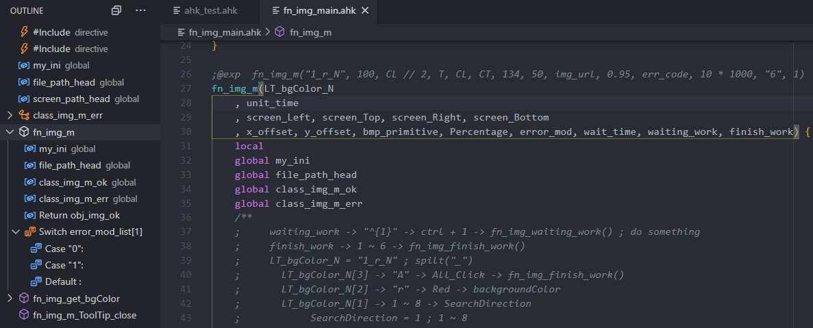

## CodeSymbol

1. You can add two semicolon `;;` at line first.
   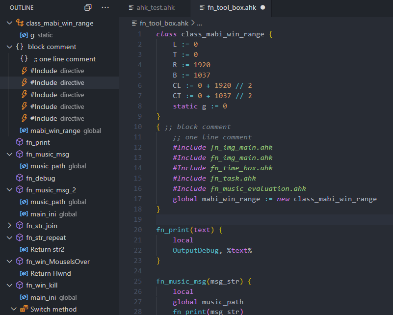

2. You can see Leveled outline

- class
- function
- switch, Case, Default
- Labels, like `this_is_a_label:`
- HotString, like `::ahk::`
- HotKeys, like `~F12::`
- directive, like `#Include` or `#Warn`

## GotoDefinition

1. Go to Definition (default via `F12` or `Ctrl+Click`)
2. open the definition to the side with (default via `Ctrl+Alt+Click` )
3. Peek Definition (default via `Alt+F12`)
4. Go to Symbol (default via `Ctrl+T`)
   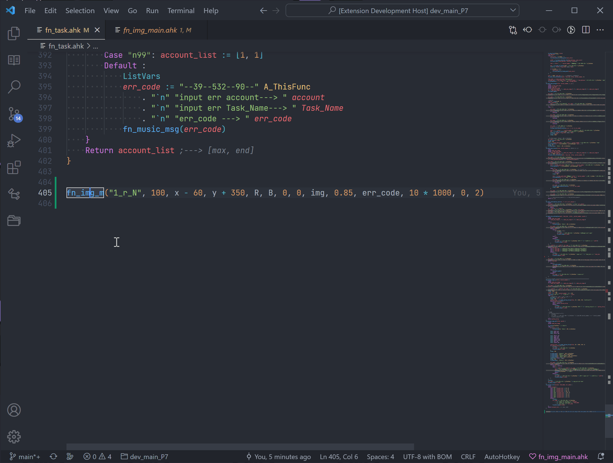
   > ↪ Go to Definition (default via `F12` or `Ctrl+Click`)

## Find All References support

1. Go to References (default via `Shift+F12`)
2. Find All References (default via `Shift+Alt+F12`)

   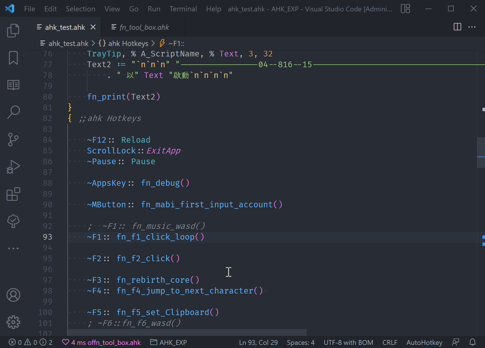
   > 🔍 Find All References (default via `Shift+F12`)

### Find Ref of Function

support to find like

1. `functionName(` , call function, but does not contain like `new ClassName()`
2. `"functionName"` , wrapped in text, _Warning_, refactoring may accidentally modify such references.
   <details>
   <summary>some exp code</summary>

   > - also can use
   > - `fnObject := func("functionName")` [[read doc of func()]](https://www.autohotkey.com/docs/v1/lib/Func.htm)
   > - `fnObject := RegisterCallback("functionName")` [read doc of RegisterCallback](https://www.autohotkey.com/docs/v1/lib/RegisterCallback.htm)

   ```ahk
    #NoEnv
    #Warn All
    SetControlDelay, 0

    ~F9:: fn_exp(["fnA","fnB"])
    ~F10:: fn_exp(["fnB","fnA"])

    fn_exp(fnList){
        For _Key, fn in fnList {
            funcOnj := Func(fn)
            funcOnj.Call()
        }
    }

    fnA(){
        MsgBox, % "i am fnA"
    }

    fnB(){
        MsgBox, % "i am fnB"
    }
   ```

   </details>

3. label -> function <https://www.autohotkey.com/docs/v1/misc/Labels.htm#Functions>
   >
   > - OK [SetTimer](https://www.autohotkey.com/docs/v1/lib/SetTimer.htm#Functor)
   > - OK [Hotkey](https://www.autohotkey.com/docs/v1/lib/Hotkey.htm#Functor)
   > - OK [Gui control events](https://www.autohotkey.com/docs/v1/lib/Gui.htm#label) (g-labels)
   > - OK [Menu](https://www.autohotkey.com/docs/v1/lib/Menu.htm#Functor)
   > - not plan to support ~~[Gui events](https://www.autohotkey.com/docs/v1/lib/Gui.htm#Labels) such as GuiClose~~

4. `Sort` F-flag <https://www.autohotkey.com/docs/v1/lib/Sort.htm#Options>

   ```ahk
   MyVar := "5,3,7,9,1,13,999,-4"
   Sort, MyVar, F IntegerSort D,
   ;              ^^^^^^^^^^^ func after F[ \t]
   MsgBox, % "MyVar is " MyVar

   IntegerSort(a1, a2)
   {
        return a1 - a2
   }
   ```

5. `RegEx` CallOut Functions<https://www.autohotkey.com/docs/v1/misc/RegExCallout.htm#callout-functions>\
   or `(?CNumber:Function)` <https://www.autohotkey.com/docs/v1/misc/RegExCallout.htm#auto>

   ```ahk
   Haystack := "The quick brown fox jumps over the lazy dog."
   RegExMatch(Haystack, "i)(The) (\w+)\b(?CCallOut)")
   ;                                       ^^^^^^^ func in (?CFuncName)
   CallOut(m) {
       MsgBox ,
           (LTrim C
               m=%m% ;  m=The quick
               m1=%m1% ;m1=The   ; m1 is Pseudo-Arrays https://www.autohotkey.com/docs/v1/misc/Arrays.htm#pseudo
               m2=%m2% ;m2=quick ; m2 is Pseudo-Arrays also
           )
       return 1
   }
   ```

6. not plan to support like `%func%()` `Func%A_Index%()` [Dynamically Calling a Function](https://www.autohotkey.com/docs/v1/Functions.htm#DynCall)
7. _warn_ this extension not match case

   ```ahk
   var := "name"
   fn%var%()

   fn := "fn"
   %fn%%var%()
   str = fnName ; not use := && ""
   func(str).call()

   fnName(){
        MsgBox % "i am fnName"
   }
   ```

8. read more of [funcRef](src/command/AnalysisFuncReference/funcRef.ahk)

## Function rename

- (default via `F2`) rename with your can use [[🔍Find Ref of Function]](#find-ref-of-function) to find.
- check of Rename newName
  1. check newFnName has been defined as `function` `class` `label`
  2. default not rename `"fnName"` , can use `AhkNekoHelp.Rename.functionInStr` open it [[Read more]](https://github.com/CoffeeChaton/vscode-autohotkey-NekoHelp/blob/main/note/code601.md)
  3. _warn_ this extension not match `fn%var%()` or `%fn%%var%()` or `str = fnName` case

## Hover

- Hover to view details on variables, function, command
- Over 200 [Command and Function](https://www.autohotkey.com/docs/v1/lib/) documenting built-in

1. Hover function to show return value or comment

   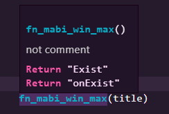

2. add comment of function

   ```ahk
   /**
    * - in /** block.
    * - and the line first character is '*' or ';'
    * - can use partial grammar of markdown.
    * - exp@email.com
    * - [Markdown Rule](https://en.wikipedia.org/wiki/Markdown)
    * - <https://en.wikipedia.org/wiki/Markdown>
    * 
    * ~~ABC~~
    * _ABC_ _ABC_
    * - - -
    *  `monospace`
   */
   fn(param){
       ; some code
   }
   ```

3. add jsdoc-style comments of variable 

   ```ahk
   f2(){
       /**
       * - [markdown-syntax](https://www.markdownguide.org/basic-syntax/)
       * - list2
       * - Love **is** bold
       *
       * style look like jsDoc
       * and you need write before at var first-def line
       */
       style1 := 0

       MsgBox, % style1 ; try to hover of "style1"!

       style2 := 1 ; i look like c++ doc style
       MsgBox, % style2 ; try to hover of "style2"!
   }
   ```

4. [`CLSID`](https://www.autohotkey.com/docs/v1/misc/CLSID-List.htm) hover [(youtube 4K 1min)](https://www.youtube.com/watch?v=mwzmmMJxax0)

## Diagnostic and lint

⚠️ Diagnostics/Warnings over 30 ruler

1. warning about use `=` not `:=` to assign.
2. warning of Switch\
   `Case : not find`
3. use `;@ahk-neko-ignore [number] line.` to ignore,\
   exp:

   ```ahk
   ;@ahk-neko-ignore 1 line
   ;@ahk-neko-ignore 2 line
   ;@ahk-neko-ignore 999 line

   ;@ahk-neko-ignore-fn 1 line
   ;@ahk-neko-ignore-fn 2 line
   ;@ahk-neko-ignore-fn 999 line

    ;use 0 to open diag
    ;@ahk-neko-ignore 0 line
    ;@ahk-neko-ignore-fn 0 line
   ```

## Format

1. Right click then click format document.
2. or `alt` + `shift` + `f`
3. format `switch case`
4. read more exp [note/ahk/format](https://github.com/CoffeeChaton/vscode-autohotkey-NekoHelp/blob/main/note/ahk/format/)
5. other setting

   ```ahk
   ;
   ;@ahk-neko-format-ignore-start
   ;@ahk-neko-format-ignore-end
   ;@ahk-neko-format-inline-spacing-ignore-start
   ;@ahk-neko-format-inline-spacing-ignore-end
   /*@ahk-neko-format-ignore-block
        ^ I think this will reduce the interference with git-diff.
   */
   ```

## SignatureHelp

- Not yet supported functions-used not in a line case.

- [x] `Signature` of `user-def-function` [youtube 4k 90-sec](https://www.youtube.com/watch?v=WcMzNcVWcYA)
- [x] `Signature` of `built-in function`
- [ ] `command` coming soon.

- calc `[]` and `{}` , at function arguments.
  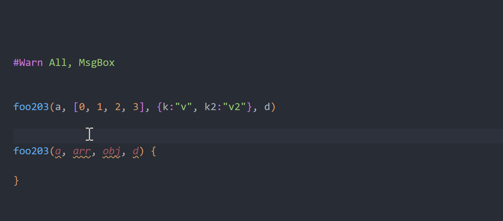

## IntelliSense

### 1. Snippets of your function

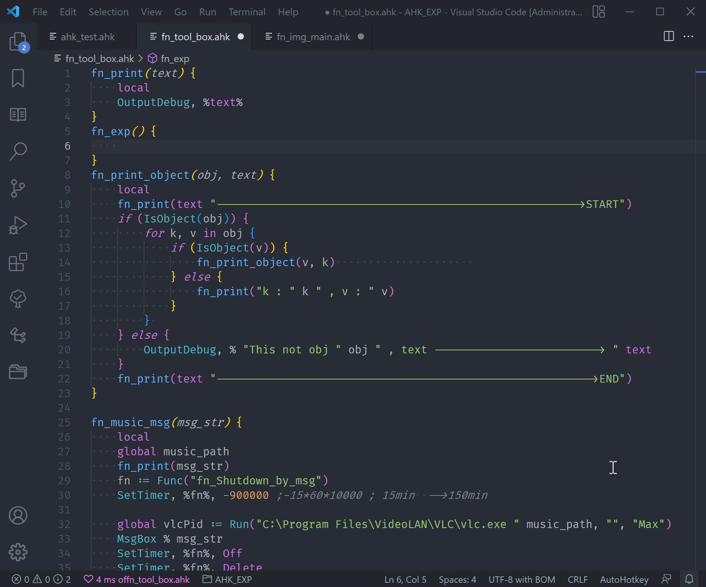

### 2. Completion of function variables

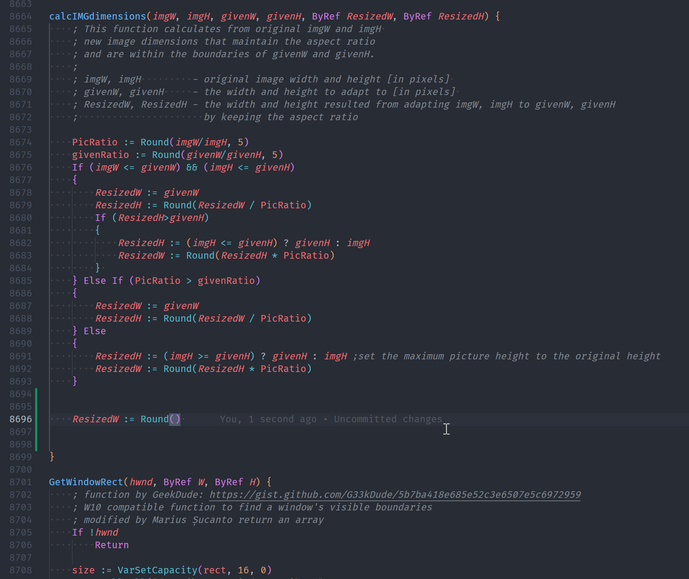

### 3. Completion of `#Include`

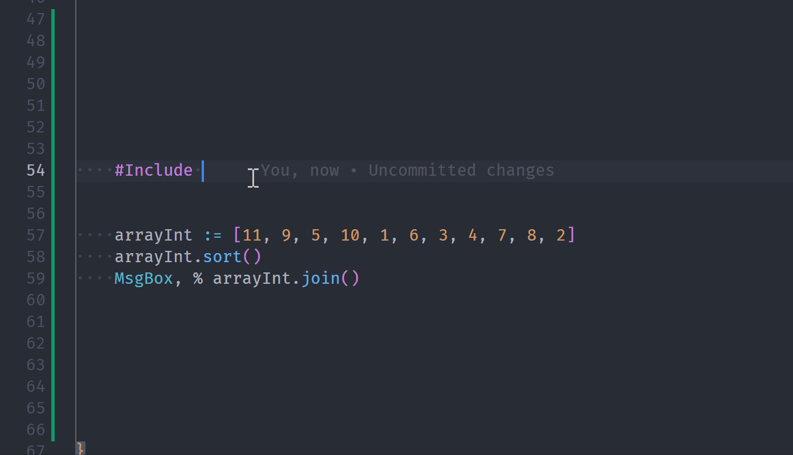

### 4. Completion of `class`

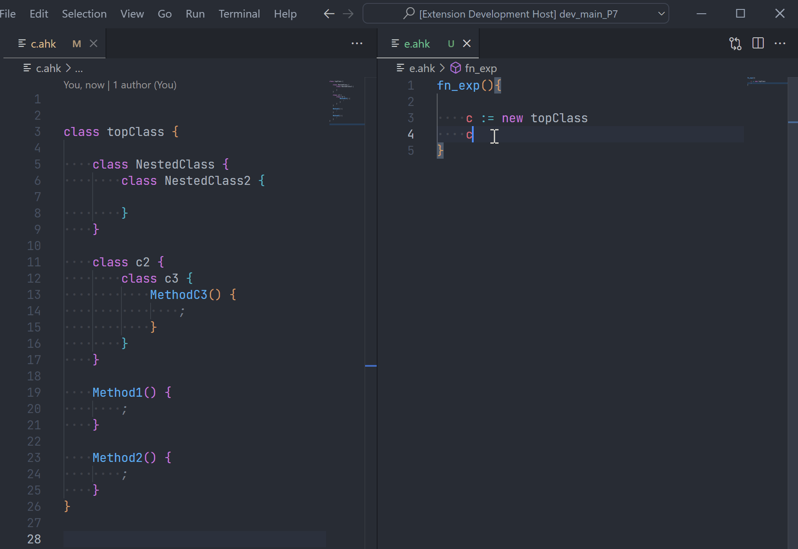

### 5. Snippet Completions for `@param` Doc Tags

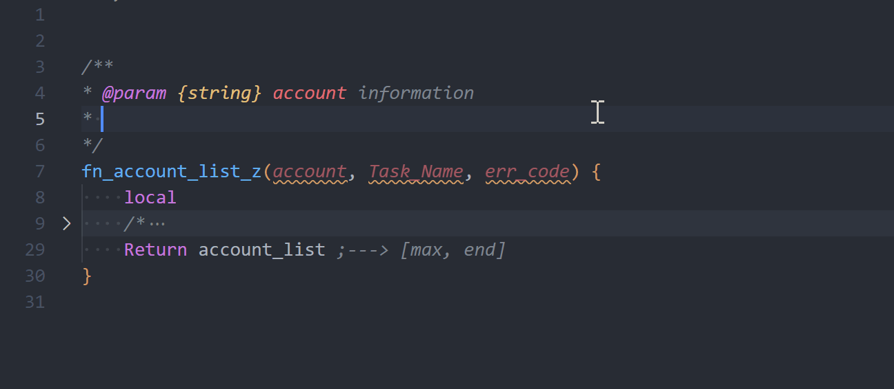

## ListAllFunctions

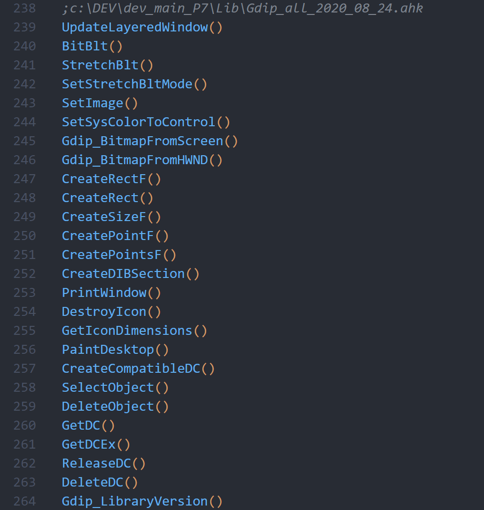

## Better highlight

### of Legacy assignment

semantic-highlight of `MyString = This is a literal string.` equal sign operator (=)

[__legacy_assignment](https://github.com/CoffeeChaton/vscode-autohotkey-NekoHelp/blob/main/syntaxes/grammar/__legacy_assignment.ahk)


### of Numbers


_theme from [One Dark Pro](https://marketplace.visualstudio.com/items?itemName=zhuangtongfa.Material-theme)_

- `0x` and `e` use `keyword.other.unit`
- other number ex `123` `007B` `3.14159` use `constant.numeric`
- exp of your `settings.json` ReadMore of [highlighting](https://code.visualstudio.com/docs/getstarted/themes#_editor-syntax-highlighting)
- [Source code](./syntaxes/ahk.tmLanguage.json)

  <details>
    <summary>settings.json</summary>

  ```jsonc
  // settings.json
  {
      "editor.tokenColorCustomizations": {
          "textMateRules": [
              {
                  "scope": "keyword.other.unit.numeric.hexadecimal.ahk",
                  "settings": {
                      "foreground": "#E06C75"
                  }
              },
              {
                  "scope": "keyword.other.unit.numeric.decimal.ahk",
                  "settings": {
                      "foreground": "#E06C75"
                  }
              },
              {
                  "scope": "constant.numeric.hexadecimal.ahk",
                  "settings": {
                      "foreground": "#D19A66"
                  }
              },
              {
                  "scope": "constant.numeric.decimal.ahk",
                  "settings": {
                      "foreground": "#D19A66"
                  }
              }
          ]
      }
  }
  ```

  </details>

### of ahk2exe

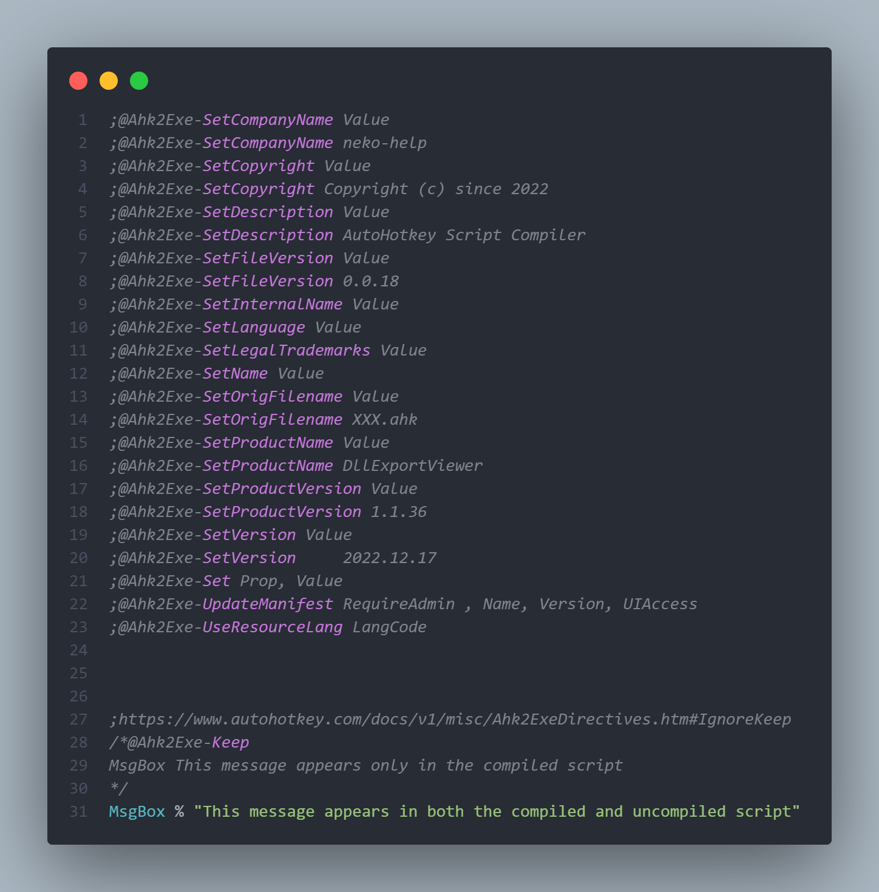

- feat: the `@Ahk2Exe` of `;@Ahk2Exe-XXX` provide semantics as `"other.customize.keyword.comment.ahk2exe.ahk"`

  <details>
    <summary>other-style</summary>

  ```jsonc
  // settings.json
  {
      "editor.tokenColorCustomizations": {
          "textMateRules": [
              {
                  "scope": "other.customize.keyword.comment.ahk2exe.ahk",
                  "settings": {
                      "foreground": "#C678DD"
                  }
              }
          ]
      }
  }
  ```

  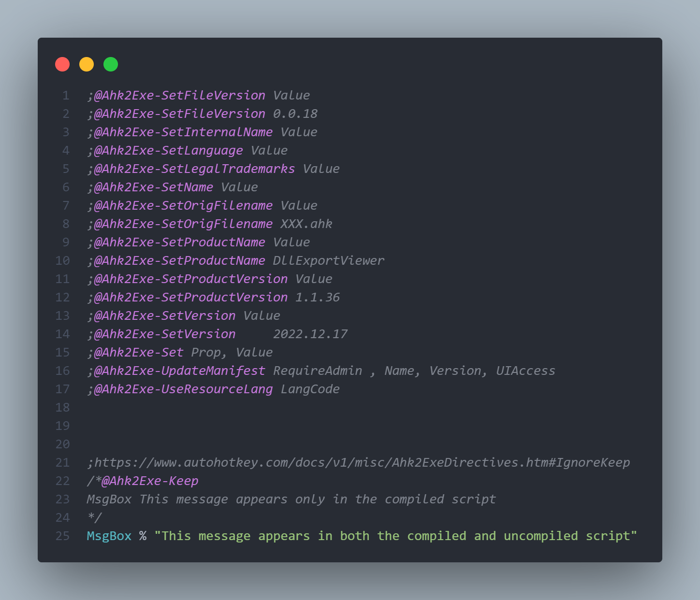
  > <https://github.com/CoffeeChaton/vscode-autohotkey-NekoHelp/issues/12#issuecomment-1518496989>
  </details>

## Quick Log Msg

default via `ctrl+alt+l`

```jsonc
// settings.json
{
    "AhkNekoHelp.customize.displayLogMessage": "MsgBox % \"♥ ~ {selectText} \" {selectText} \" at \" A_ThisFunc"
}
```

## Privacy Statement

- Do not upload any information.
- only use vscode provided api, not any third party dependencies, Safe and Privacy.
- just scan workspaces or open file. not auto scan any file without workspaces, until option the `"AhkNekoHelp.file.tryParserInclude"`.
- If you need to place .ahk in other folders, this Extensions support [Multi-root Workspaces](https://code.visualstudio.com/docs/editor/multi-root-workspaces).

## Performance

- The best way to improve startup times is to exclude unnecessary files, via [settings.json](https://code.visualstudio.com/docs/getstarted/settings) `AhkNekoHelp.files.exclude`
- When editing becomes slow, split the file, via [`#Include`](https://www.autohotkey.com/docs/v1/lib/_Include.htm)

- via `'Refresh Resource'` to find each file parsing time.

## Credits

- [AutoHotkey by stef-levesque](https://github.com/stef-levesque/vscode-autohotkey) : ancestor of the series
- [AutoHotkey Plus by cweijan](https://github.com/cweijan/vscode-autohotkey) : project start
- [AutoHotkey_L-Docs](https://github.com/Lexikos/AutoHotkey_L-Docs) : Embed documents of completion/hover etc.
- [AutoHotkey_L](https://github.com/Lexikos/AutoHotkey_L) : Refer to the implementation of the c++ function
- [helsmy/AutoHotKey Simple Support](https://github.com/helsmy/vscode-autohotkey) : [hotkey/hotstring regexp](https://github.com/helsmy/vscode-autohotkey/issues/17)
- [microsoft/TypeScript-TmLanguage](https://github.com/microsoft/TypeScript-TmLanguage/commit/644389aef914fc6fbc97a4dd799cc2d1431ffc87) : `jsdoc` syntax-highlight like the 'inline-tags', 'brackets', 'jsdoctype', 'docblock' code.

## otherSuggest

- [Path Autocomplete](https://marketplace.visualstudio.com/items?itemName=ionutvmi.path-autocomplete)
- [AutoHotKey Debug](https://marketplace.visualstudio.com/items?itemName=helsmy.autohotkey-debug)
