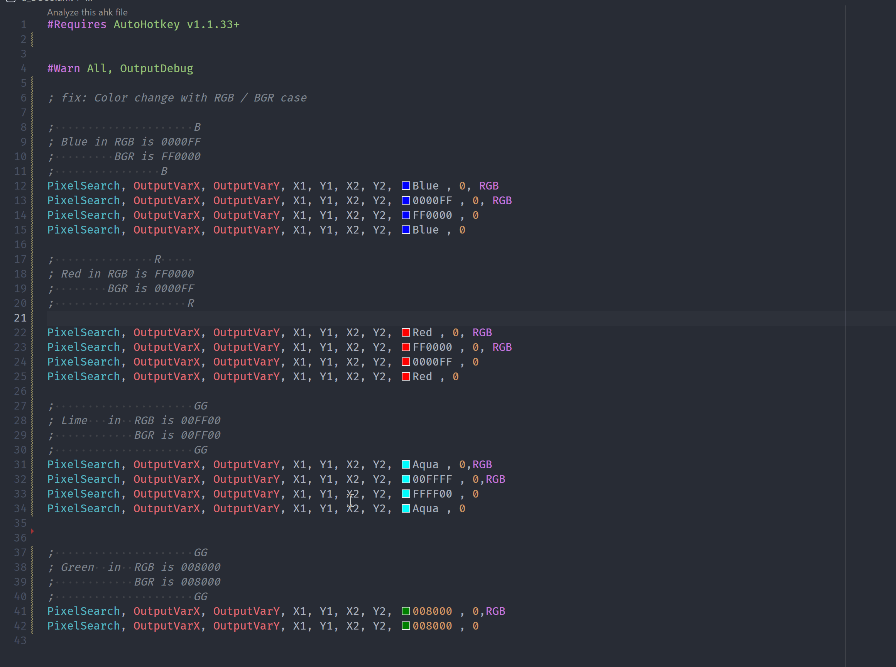

# ColorProvider (color-picker)

## like

<https://github.com/CoffeeChaton/vscode-autohotkey-NekoHelp/issues/50>
<https://github.com/CoffeeChaton/vscode-autohotkey-NekoHelp/issues/75>
<https://github.com/CoffeeChaton/vscode-autohotkey-NekoHelp/issues/76>

<https://www.autohotkey.com/docs/v1/lib/Progress.htm#colors>
<https://www.autohotkey.com/docs/v1/lib/PixelSearch.htm>

## config

```jsonc
// settings.json
{
    "AhkNekoHelp.useColorProvider": true
}
```

## hide with line

send `;` and `@` while show it

```ahk
;@ahk-neko-color-picker-ignore 999 line
```



## advantage

Differences from the universal color picker.

- more identify like `cRed` `+BackgroundFF9977` `cbRed` ...etc ahk unique cases

try to copy and show it

```ahk
;https://www.autohotkey.com/docs/v1/lib/Gui.htm#Font
Gui, Add, Text, cRed, My Text
;                  ^^^

Gui, Color , WindowColor, ControlColor
Gui, Color, EEAA99
;            ^^^^^^^^

WinSet, TransColor, Color
WinSet, TransColor, EEAA99
;                   ^^^^^^^^

PixelSearch, OutputVarX, OutputVarY, X1, Y1, X2, Y2, 0x444444 , Variation, Mode ;https://www.autohotkey.com/docs/v1/lib/PixelSearch.htm
;                                                    ^^^^^^^^

Menu, MenuName, Color, ColorValue , Single ;https://www.autohotkey.com/docs/v1/lib/Menu.htm#Color
Menu, MenuName, Color, 0x444444 , Single ;https://www.autohotkey.com/docs/v1/lib/Menu.htm#Color
;                      ^^^^^^^^

Gui, Add, ListView, cEEAA99, ; https://www.autohotkey.com/docs/v1/lib/ListView.htm
GuiControl, +BackgroundFF9977, MyListView ;https://www.autohotkey.com/docs/v1/lib/Gui.htm#Color
;                      ^^^^^^
```

- auto identify RGB/BGR case

<https://github.com/CoffeeChaton/vscode-autohotkey-NekoHelp/issues/76>

- auto ignore case
  - varName = color name like `red := setColor()` ... <https://github.com/CoffeeChaton/vscode-autohotkey-NekoHelp/issues/76>

## other

My current plan is to actively display color-picker on all occasions as long as the value looks like a color.
