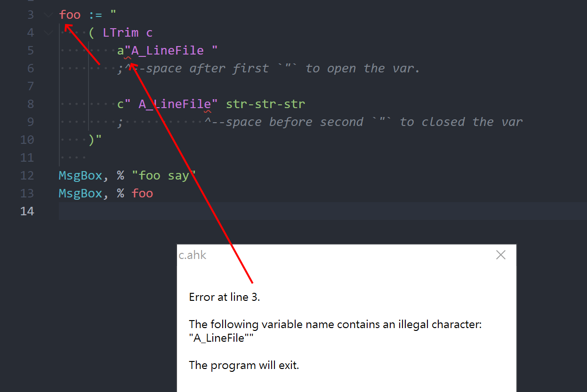
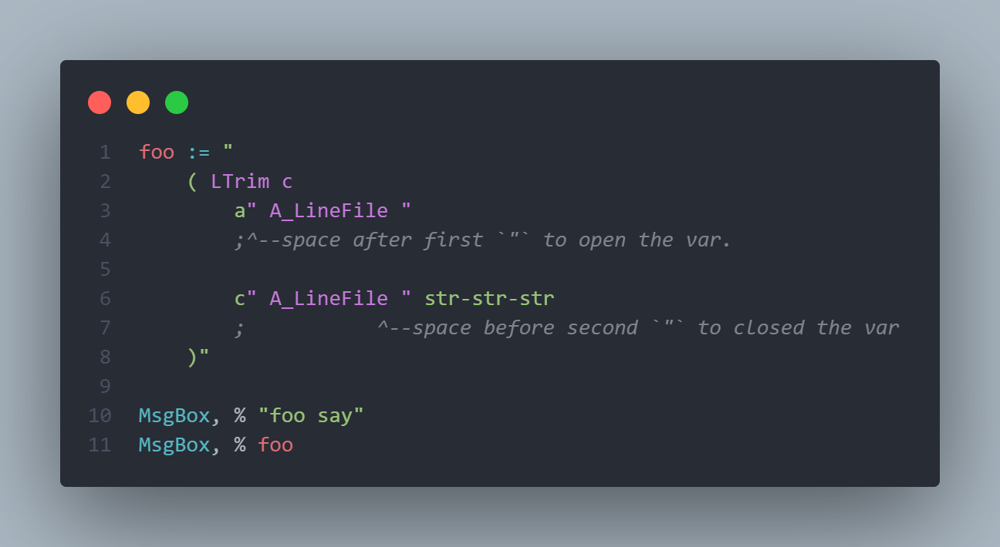

# code 127

```js
127: {
    msg: 'Multiline just allow like `" VarName "` of style2, `"` need to use whitespace pack varName.',
    path: 'https://github.com/CoffeeChaton/vscode-autohotkey-NekoHelp/blob/main/note/code127.md',
},
```



```ahk
; error case try it
foo := "
    ( LTrim c
        a"A_LineFile "
        ;^--space after first `"` to open the var.

        c" A_LineFile" str-str-str
        ;           ^--space before second `"` to closed the var
    )"
    
MsgBox, % "foo say"
MsgBox, % foo
```



```ahk
; OK Case
foo := "
    ( LTrim c
        a" A_LineFile "
        ;^--space after first `"` to open the var.

        c" A_LineFile " str-str-str
        ;           ^--space before second `"` to closed the var
    )"
    
MsgBox, % "foo say"
MsgBox, % foo
```
