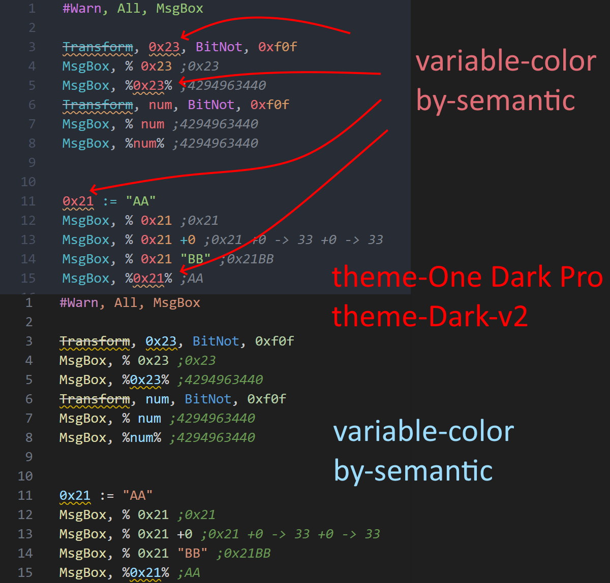

# code507 avoid set `Number` as variable

## exp1

Because ahk v1.1, don't warn before running, so I provide this option.

```ahk
#Warn, All, MsgBox

0x001 := "9999"
MsgBox, % 0x001 ; show "0x001"
MsgBox, % 0x001 + 0 ; show 0, Because "0x001" + 0    ->    0 + 0    ->   0

0x001 := 9999
MsgBox, % 0x001 ; "0x001"
MsgBox, % 0x001 + 0 ;

0x001 := "str-str-str"
MsgBox, % 0x001 ; "0x001"
MsgBox, % 0x001 + 0 ;
```

## exp2

some-case is legal, but unreasonable (For the 1 hour I wasted.)

```ahk
#Warn, All, MsgBox

Transform, 0x23, BitNot, 0xf0f
;          ^ show warn message at this, When the code review is tired, this kind of code may be accidentally approved to enter the official code
MsgBox, % 0x23 ;0x23
MsgBox, %0x23% ;4294963440 ;If this is after 2000 lines, this will be a happy trap

Transform, num, BitNot, 0xf0f
MsgBox, % num ;4294963440
MsgBox, %num% ;4294963440


0x21 := "AA" 
;^ show warn message at this,
MsgBox, % 0x21 ;0x21
MsgBox, % 0x21 +0 ;0x21 +0 -> 33 +0 -> 33
MsgBox, % 0x21 "BB" ;0x21BB
MsgBox, %0x21% ;AA
```



## exp3

```ahk
#Warn, All, MsgBox

1 := "AA"
MsgBox, % 1 ;1
MsgBox, % 1 +0 ;1
MsgBox, % 1 "BB" ;1BB
MsgBox, %1% ;AA

20 = "AA"
MsgBox, % 20 ;20
MsgBox, % 20 +0 ;20
MsgBox, % 20 "BB" ;20BB
MsgBox, %20% ;AA
```
