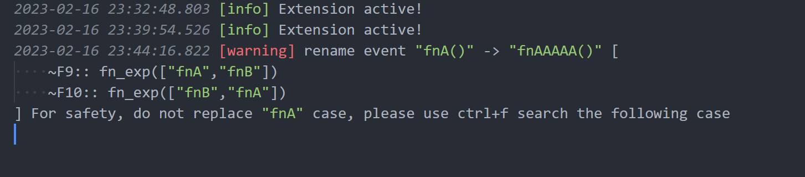

# config-rename-option

- `false` default not to rename "funcName" case

  ```ahk
  MsgBox % "GetSystemMetrics"
  ;         ^^^^^^^^^^^^^^^^ default not want to rename this

  GetSystemMetrics(int){
      DllCall("GetSystemMetrics", int, 4, "int")
      ;        ^^^^^^^^^^^^^^^^ default not want to rename this
      ;......
  }
  ```

- `true` if open this config

  ```ahk
  ~F9:: fn_exp(["fnA","fnB"])
  ;              ^^^   ^^^
  ~F10:: fn_exp(["fnB","fnA"])
  ;               ^^^   ^^^

  fn_exp(fnList) {
      For _Key, fn in fnList {
          funcOnj := Func(fn)
          funcOnj.Call()
      }
  }

  fnA() {
      MsgBox, % "i am fnA"
  }

  fnB() {
      MsgBox, % "i am fnB"
  }
  ```

- always provide logging like

  ```log
  2023-02-16 23:44:16.822 [warning] rename event "fnA()" -> "fnAAAAA()" [
      ~F9:: fn_exp(["fnA","fnB"])
      ~F10:: fn_exp(["fnB","fnA"])
  ] For safety, do not replace "fnA" case, please use ctrl+f search the following case
  ```

  
