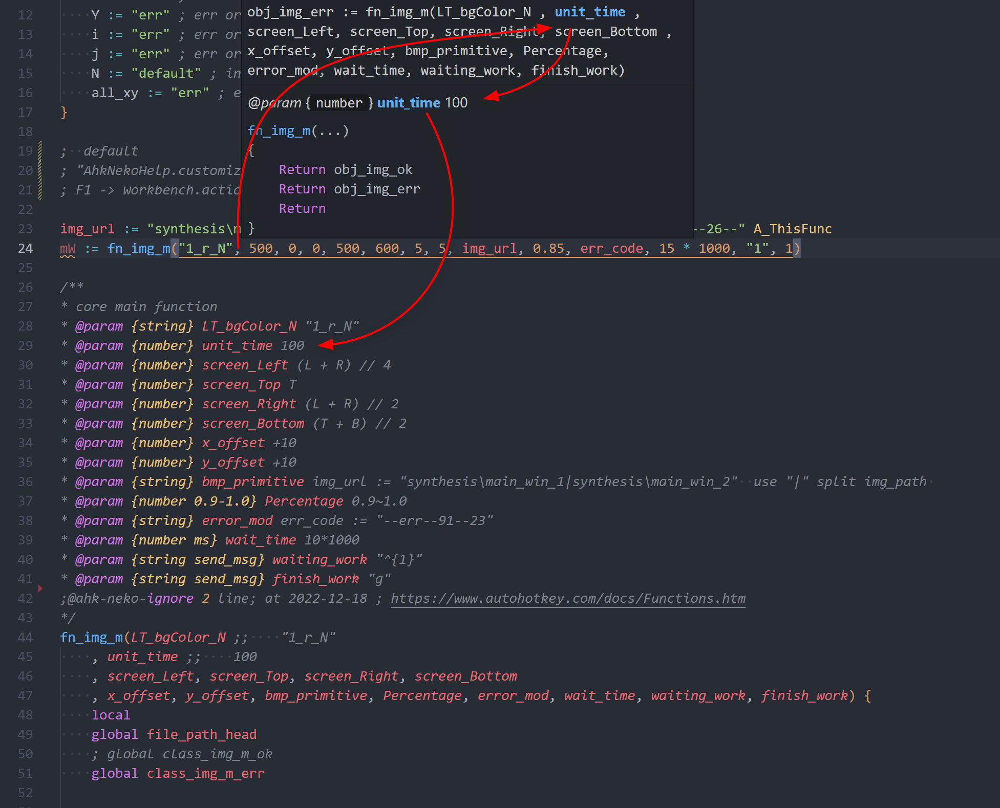

# customize.signatureHelp

## exp

1. `@param {type} param_name information`
2. `@return {type} information`

Currently there are only these `2 tags`, which are enhanced.

````ahk
img_url := "synthesis\main_win_1|synthesis\main_win_2", err_code := "1^--45--493--26--" A_ThisFunc
mW := fn_img_m("1_r_N", 500, 0, 0, 500, 600, 5, 5, img_url, 0.85, err_code, 15 * 1000, "1", 1)

/**
* core main function
* @param {string} LT_bgColor_N "1_r_N"
* @param {number} unit_time 100
* @param {number} screen_Left (L + R) // 4
* @param {number} screen_Top T
* @param {number} screen_Right (L + R) // 2
* @param {number} screen_Bottom (T + B) // 2
* @param {number} x_offset +10
* @param {number} y_offset +10
* @param {string} bmp_primitive img_url := "synthesis\main_win_1|synthesis\main_win_2"  use "|" split img_path 
* @param {number 0.9-1.0} Percentage 0.9~1.0
* @param {string} error_mod err_code := "--err--91--23"
* @param {number ms} wait_time 10*1000
* @param {string send_msg} waiting_work "^{1}"
* @param {string send_msg} finish_work "g"
* @exp
*
* ```ahk
* fn_img_m("1_r_N", 100, CL // 2, T, CL, CT, 134, 50, img_url, 0.95, err_code, 10 * 1000, "6", 1)
* ```
*
*    fn_img_m("1_r_N", 100, CL // 2, T, CL, CT, 134, 50, img_url, 0.95, err_code, 10 * 1000, "6", 1)
*
*    waiting_work -> "^{1}" -> ctrl + 1 -> fn_img_waiting_work() ; do something
*    finish_work -> 1 ~ 6 -> fn_img_finish_work()
*    LT_bgColor_N = "1_r_N" ; spilt("_")
*        LT_bgColor_N[3] -> "A" -> All_Click -> fn_img_finish_work()
*        LT_bgColor_N[2] -> "r" -> Red -> backgroundColor
*        LT_bgColor_N[1] -> 1 ~ 8 -> SearchDirection
;@ahk-neko-ignore 2 line; at 2022-12-18 ; https://www.autohotkey.com/docs/Functions.htm
*/
fn_img_m(LT_bgColor_N ;;    "1_r_N"
    , unit_time ;;    100
    , screen_Left, screen_Top, screen_Right, screen_Bottom
    , x_offset, y_offset, bmp_primitive, Percentage, error_mod, wait_time, waiting_work, finish_work) {
        /*
        * some-code is private 
        */
        if (LT_bgColor_N == "1_r_N"){
            Return OK
        } else if (LT_bgColor_N == "2_r_N"){
            Return ERROR
        }
        Return
}
````

## option

- `0` - concise mode
- `1` - focus mode
- `2` - focus mode + return type
- `3` - full Information mode



> option 2

## note

_Note_ after the option changed, please _restart vscode_ or `F1 -> "ahk-neko-help:Refresh Resource"`
