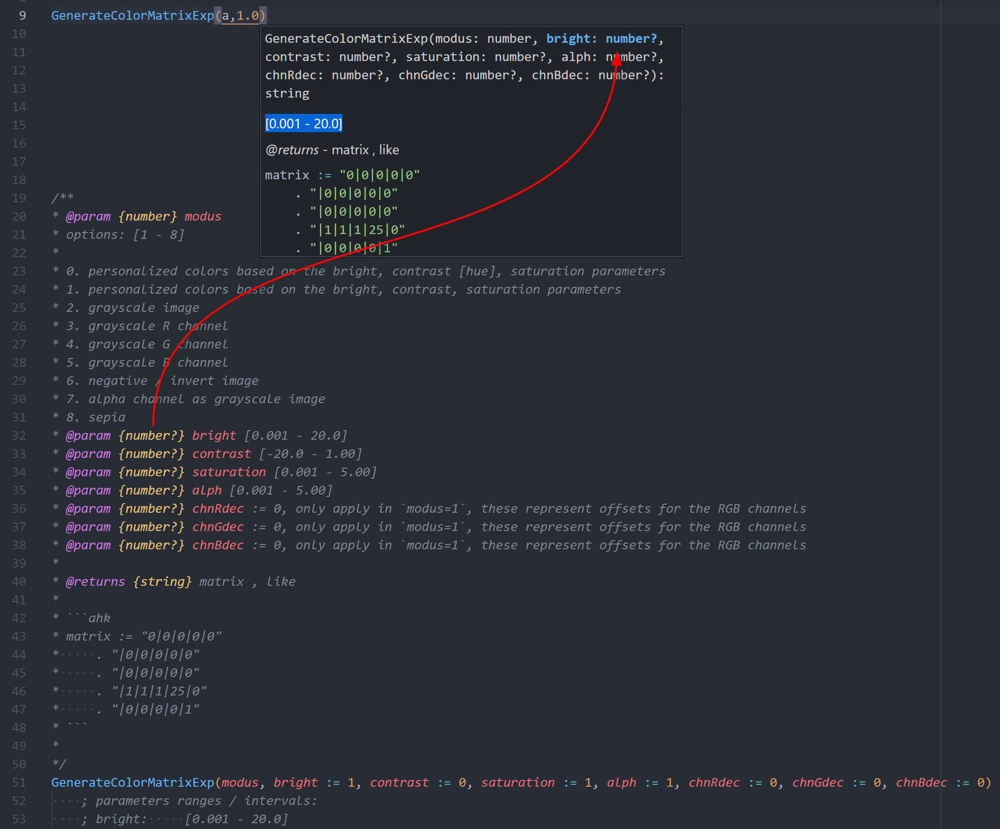
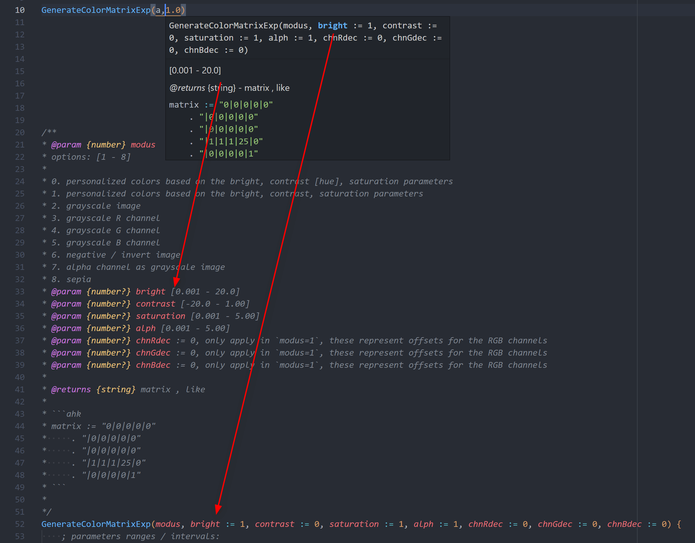

# `"signatureHelp.insertType"`

## options `true`

## options `false`

## other

[issues #17](https://github.com/CoffeeChaton/vscode-autohotkey-NekoHelp/issues/17)

> `@param` can generate type from default value
