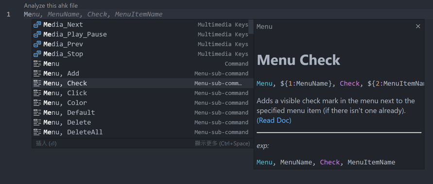
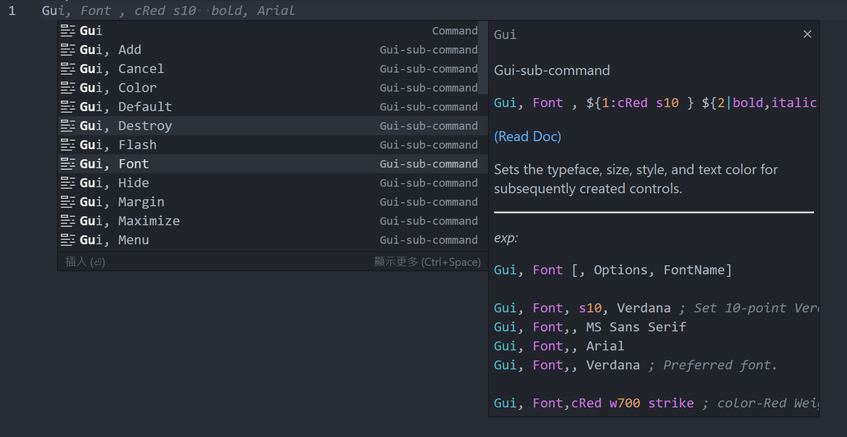
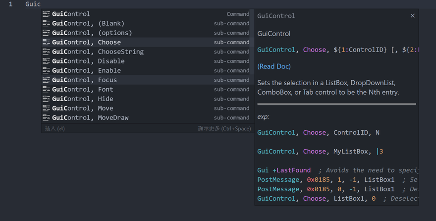
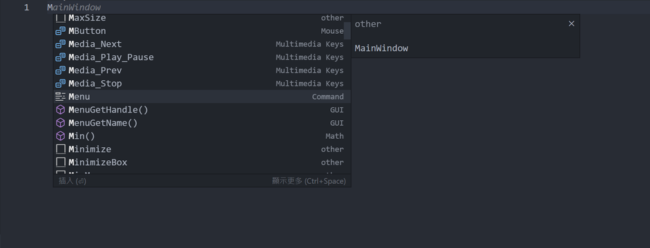

# snippets.subCmdPlus

## true(default)

1. if first word start with `M` `Me` `Men` `Menu` provide `Menu sub-Command` completion.
2. if first word start with `G` `Gu` `Gui` provide `Gui sub-Command` completion.
3. if first word start with `G` `Gu` `Gui` or `GuiControl` provide `GuiControl sub-Command` completion.
4. if first word start with `S` `Sy` `SysGet` provide `SysGet sub-Command` completion.
5. `WinSet` ...
6. `WinGet` ...
7. `Control` ...

## false

if your function/variable/anything starts with `G` `M` or just don't use `Gui` or `Menu` commands,
anyway you don't want to be overwhelmed by expanded completions, you can turn this option off.

